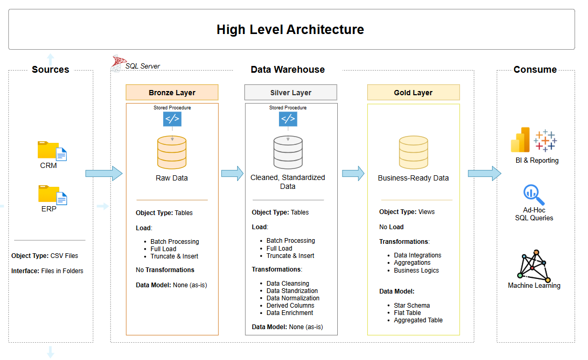
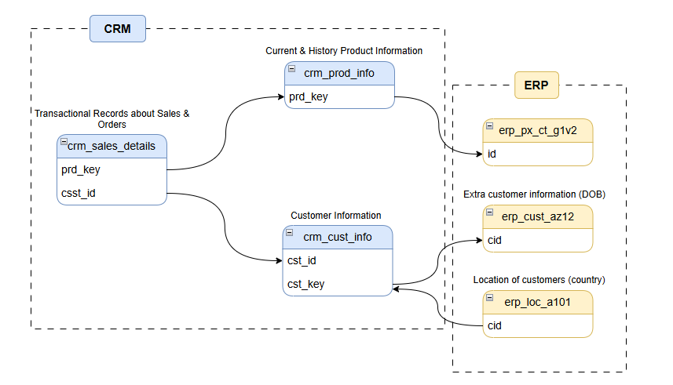
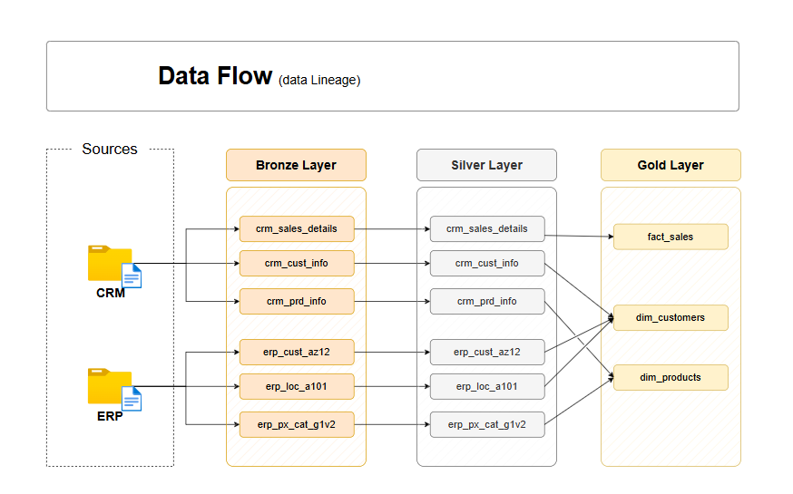

# 🚀 End-to-End SQL Data Warehouse & Analytics Solution

## 🎯 Project Overview
This project demonstrates the design and implementation of a modern Data Warehouse using **SQL Server**. The goal was to consolidate disparate data from two primary source systems—**CRM** and **ERP**—into a centralized, business-ready environment. 

By applying the **Medallion Architecture**, I transformed raw, messy CSV data into a structured Gold layer optimized for advanced analytics and high-performance reporting.

## 🏗️ Technical Architecture & Automation



The data flow follows the Medallion Framework (Bronze, Silver, Gold). To ensure scalability and maintainability, I **automated the ETL process using Stored Procedures**, allowing for a one-click refresh of the entire pipeline from raw ingestion to final modeling.



* **Bronze (Raw):** Initial ingestion of source CSV files into staging tables.
* **Silver (Cleansed):** Data engineering layer focusing on deduplication, handling missing values, and schema standardization.
* **Gold (Curated):** Business layer modeled into a **Star Schema** with optimized Fact and Dimension tables.



## 💻 Technical Highlights: Data Transformation
The following T-SQL snippet showcases the logic used in the **Silver Layer** to clean product metadata, handle nulls, and derive historical date ranges using Window Functions:

```sql
SELECT
    prd_id, 
    -- Standardizing Category IDs and extracting Product Keys
    REPLACE(SUBSTRING(prd_key, 1, 5), '-', '_') AS cat_id,
    SUBSTRING(prd_key, 7, LEN(prd_key)) AS prd_key, 
    prd_nm,
    -- Handling missing costs with default values
    ISNULL(prd_cost, 0) AS prd_cost,
    -- Mapping legacy codes to descriptive business values
    CASE WHEN UPPER(TRIM(prd_line)) = 'M' THEN 'Mountain'
         WHEN UPPER(TRIM(prd_line)) = 'R' THEN 'Road'
         WHEN UPPER(TRIM(prd_line)) = 'S' THEN 'Other Sales'
         WHEN UPPER(TRIM(prd_line)) = 'T' THEN 'Touring'
         ELSE 'n/a'
    END AS prd_line, 
    CAST(prd_start_dt AS DATE) prd_start_date,
    -- Dynamically deriving end dates using Window Functions (LEAD)
    CAST(LEAD (prd_start_dt) OVER (PARTITION BY prd_key ORDER BY prd_start_dt) - 1 AS DATE) prd_end_dt
FROM bronze.crm_prd_info;
```

## 📊 Data Dictionary (Gold Layer)
The Gold Layer represents the final, business-ready data modeled into a Star Schema. Below is a high-level overview of the tables and their key attributes:

### 1. gold.dim_customers
Stores customer demographic and geographic data.
* **Keys:** `customer_key` (INT), `customer_id` (INT)
* **Attributes:** `customer_number`, `first_name`, `last_name`, `country`, `marital_status`, `gender` (NVARCHAR)
* **Dates:** `birthdate`, `create_date` (DATE)

### 2. gold.dim_products
Stores product attributes and categorization details.
* **Keys:** `product_key` (INT), `product_id` (INT)
* **Attributes:** `product_number`, `product_name`, `category_id`, `category`, `subcategory`, `maintenance_required`, `product_line` (NVARCHAR)
* **Metrics & Dates:** `cost` (INT), `start_date` (DATE)

### 3. gold.fact_sales
Stores transactional sales data and calculated metrics.
* **Keys:** `order_number` (NVARCHAR), `product_key` (INT), `customer_key` (INT)
* **Dates:** `order_date`, `shipping_date`, `due_date` (DATE)
* **Metrics:** `sales_amount` (INT), `quantity` (INT), `price` (INT)

> **Note:** For a comprehensive breakdown of all columns, data types, and business definitions, please refer to the `data_catalog.md` file in the repository.

## 🛠️ Key Features & Skills Applied
* **ETL Automation:** Wrapped Bronze and Silver layer logic into **Stored Procedures** to streamline data processing.
* **Advanced SQL Scripting:** Expert use of `CASE` statements, `SUBSTRING` for parsing, and `LEAD()` window functions for time-series data.
* **Data Modeling:** Implemented a **Star Schema** to support complex business logic and simplify reporting for BI tools.
* **Data Quality Assurance:** Implemented `ISNULL` logic and data type casting (`CAST`) to ensure downstream analytical accuracy.

## 📂 Repository Structure
* `/datasets`: Original CRM and ERP source files.
* `/scripts/stored_procedures`: SQL scripts that automate the Bronze and Silver transformations.
* `/scripts/silver`: Transformation logic for cleaning and standardization.
* `/scripts/gold`: Final modeling scripts for Fact and Dimension tables.
* `/tests`: Quality check scripts to verify data accuracy.

## ⚙️ Tools Used
* **Database:** Microsoft SQL Server
* **Management:** SQL Server Management Studio (SSMS)
* **Design:** Draw.io (Architecture & ER Diagrams)
* **Version Control:** Git & GitHub
